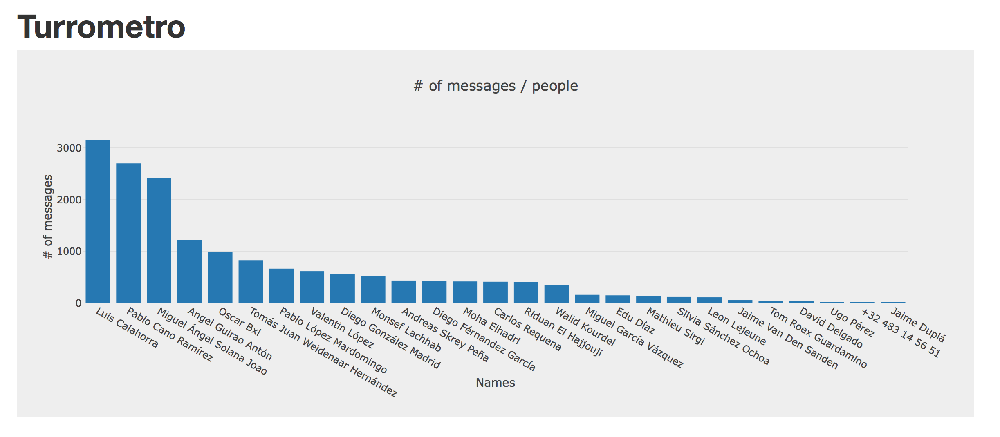

# Turrometro


[NON PLVS TVRRA !](https://twitter.com/vidamodernaoml/status/872453108856635392?lang=en)


## Usage

Have a `chat.txt` (get it from the Whatsapp app) in the resources
folder and:

```
lein run
```

The results will be automatically saved in `turrometro.html` (plot.ly).


